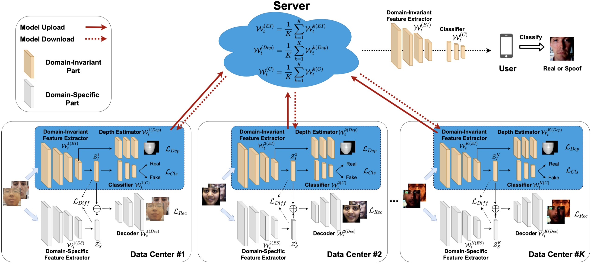

# TNNLS2022-FedGPAD
Pytorch codes for Federated Generalized Face Presentation Attack  Detection <a href=https://arxiv.org/pdf/2104.06595.pdf> (pdf) </a> in TNNLS 2022.

A face presentation attack detection (fPAD)  model with good generalization can be obtained when it is trained with face images from different input distributions and different types of spoof attacks. In reality, training data are not directly shared between data owners due to legal and privacy issues. In this paper, with the motivation of circumventing this challenge, we propose a Federated Generalized Face Presentation Attack Detection (FedGPAD) framework, studying the generalization issue of federating learning for fPAD in a data privacy preserving way.

In the proposed framework, each data owner (referred to as data centers) locally trains its own fPAD model. A server learns a global fPAD model by iteratively aggregating model updates from all data centers without accessing private data in each of them. To equip the aggregated fPAD model in the server with better generalization ability to unseen attacks from users, a federated domain disentanglement strategy is introduced in FedGPAD, which treats each data center as one domain and decomposes the fPAD model into domain-invariant and domain-specific parts in each data center. Two parts disentangle the domain-invariant and domain-specific features from images in each local data center, respectively. Several losses (i.e., cross-entropy classification loss, depth estimation loss, image reconstruction loss, and feature difference loss) are proposed in this federated domain disentanglement strategy. A server learns a global fPAD model by only aggregating domain invariant parts of the fPAD models from data centers and thus a more generalized fPAD model can be aggregated in server in a data privacy preserving manner.
